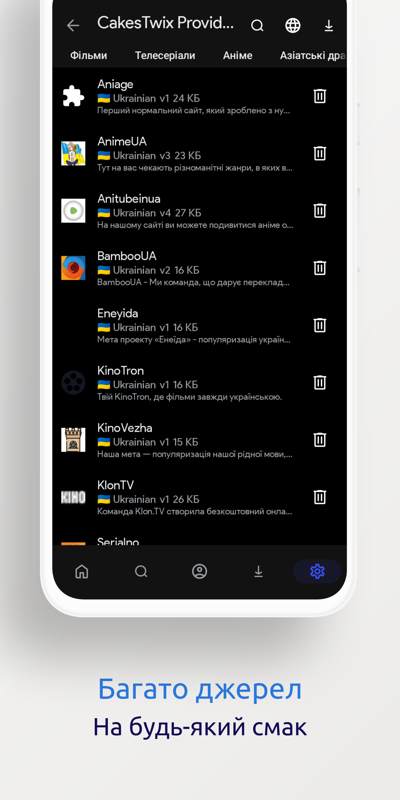

<p align="center">
	<!-- Title -->
	<br>
	<b>🇺🇦 Розширення Cloudstream (Україна)</b>
</p>
<p align="center">


</p>

| <p align="center"></p> | <p align="center"></p> | <p align="center"></p> | <p align="center"></p> |
|-----|--------|-----|--------|

<!-- Brief information about the extension -->
## 📖 Що це таке?
Це спеціальне розширення для перегляду фільмів, серіалів та аніме в якісному українському дубляжу від різних постачальників в стрімінговій програмі [Cloudstream](https://github.com/recloudstream/cloudstream).

<!-- Installation guide -->
## ⚙️ Інсталяція
Скопіюйте посилання нижче і перейдіть в Додаток -> Параметри -> Розширення -> Додати репозиторій (можна не додавати свою назву, тільки посилання)
```
https://raw.githubusercontent.com/CakesTwix/cloudstream-extensions-uk/master/repo.json
```
або
```
cakes
```

## 💰 Підтримка фінансово
Я особисто вже давно не користуюся цим проектом, тому підтримую цей проект коли є бажання, але цього бажання вже менше й менше.
Якщо хтось хоче підтримати мене та моє бажання підтримувати далі проект - [🫙 банка у монобанку](https://send.monobank.ua/jar/AaiCgzWnCn)

## 🪲 Можливі проблеми
1. На AndroidTV або на огризках від китайців можливі проблеми через те, що провайдери блокують сайти, я фіг знаю чому воно працює на телефоні, а на ТБ ні, але достатьно буде увімкнути DoH aka DNS over HTTPS у застосунку або у налаштуваннях андроїду
1. Хочу дивитися на iPhone, що робити? Продати та купити нормальний телефон, а не огризок :)
1. Якщо у вас щось не працює, не завантажує контент, тощо - вам до розділу підтримка

<!-- Support -->
## ✅ Підтримка
  - [Fediverse](https://shkey.cakestwix.com/@CakesTwix) aka @CakesTwix@shkey.cakestwix.com
  - [Matrix-чат](https://matrix.to/#/#cakestwix:matrix.org)
  - [Телеграм-чат](https://t.me/cs3_ukraine)

<!-- Contributing -->
## 💖 Зробити внесок
Внески завжди вітаються! Якщо щось зламається - не кричіть, що гівно, краще піду в X. Краще напишіть Issue про проблему, яка у вас трапилася. Я давно вже не користуюся своїм творінням, тому баги, які останнім часом фікшу - багрепорти від користувачів. Так само буду радий, якщо ви особисто надішлете мені Pull Request!

## 🛠 Збірка
  - Windows: `.\gradlew.bat ExampleProvider:make` або `.\gradlew.bat ExampleProvider:deployWithAdb`
  - Linux & Mac: `./gradlew ExampleProvider:make` або `./gradlew ExampleProvider:deployWithAdb`

<!-- Developers -->
## ⭐️ Розробники
  - [@CakesTwix](https://www.github.com/CakesTwix)

<p align="center">
	<br><a href="https://discord.gg/5Hus6fM"></a>
</p>
